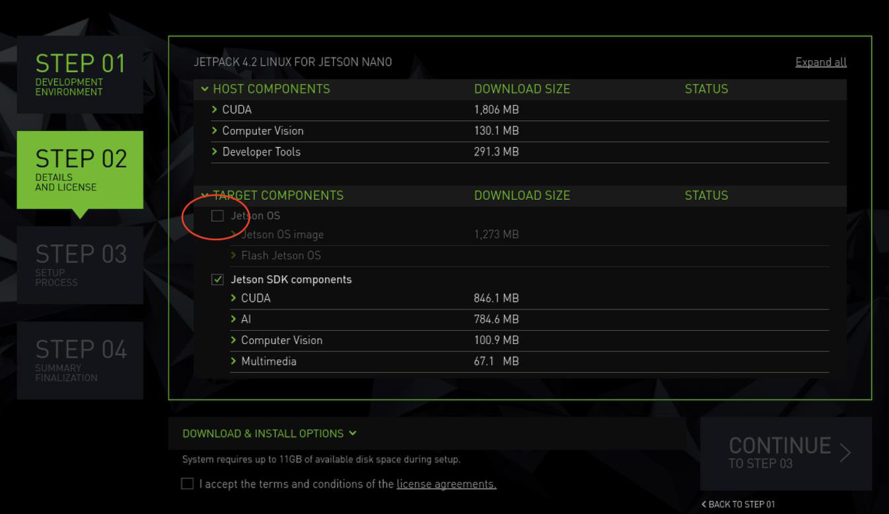

# Build gpu-camera-sample with LI-IMX477-MIPI support on AGX Jetson Xavier
## Driver installation
1. Download the L4T R32.R32. 5.1 for Xavier from https://www.dropbox.com/sh/pp0kb4qby4u252e/AAD-CPjWA36-uWgBszoQluOLa?dl=0 to your Ubuntu OS on Intel x64 host PC 
Untar the files and assemble the rootfs with the following commands:
``` console
   sudo tar xpf Tegra186_Linux_R32.5.1_aarch64.tbz2
   cd Linux_for_Tegra/rootfs/
   sudo tar xpf ../../Tegra_Linux_Sample-Root-Filesystem_R32.5.1_aarch64.tbz2
   cd ..
   sudo ./apply_binaries.sh
```
2. Flash the software image onto your Jetson Developer Kit
   * Connect the Dev kit to Ubuntu Host PC through USB Micro-B (TX2 or NX) or USB Type-C (Xavier) cable. Put your Jetson Developer Kit into "USB Recovery Mode" (RCM). In all cases, press and hold the "REC" (force recovery) button for the duration of this step. Then, if your Jetson Developer Kit is powered off, press and release the "POWERBTN" button, or if your Jetson Developer Kit is already powered on, press and release the "RST" (reset) button. Finally, release the "REC" button.

   * Install (flash) the L4T release onto the Jetson Developer Kit, by executing the following command on your Linux host system:
	Jetson AGX Xavier:
    ``` console
      sudo ./flash.sh jetson-xavier mmcblk0p1
    ```
	or Jetson Xavier NX with production SOM (without micro-SD card):
    ``` console
      sudo ./flash.sh jetson-xavier-nx-devkit-emmc mmcblk0p1
    ```
	or Jetson Xavier NX with Devkit SOM (with micro-SD card):
    ``` console
      sudo ./flash.sh jetson-xavier-nx-devkit mmcblk0p1
	```
    or Jetson TX2:
    ``` console
      sudo ./flash.sh jetson-tx2 mmcblk0p1
    ```
    This will take about 10 minutes; more on slower host systems. The Jetson Developer Kit automatically reboots upon completion of the installation process. After finish the system configuration wizard, you can login Ubuntu desktop.
3. Reboot Xavier and Put your system into "reset recovery mode" again.
4. Copy the tegra194-p2888-0001-p2822-0000.dtb (which was downloaded from the Driver link and replace the same file under Linux_for_Tegra/kernel/dtb on your Ubuntu host PC.
5. Under Linux_for_Tegra/ do
    ``` console
    sudo ./flash.sh -k kernel-dtb jetson -xavier mmcblk0p1 
    ```
6. After boot up Xavier copy “Image” to /boot on Xavier
7. Restart the Xavier. After boot up, open a terminal and do "nvgstcapture-1.0”. You will get live video output.
## CUDA installation
Install CUDA. Connect Jetson AGX Xavier to Ubuntu Intel x64 host PC. Install NVidia sdk manager. Run sdkmanager. On Step 2 uncheck "Jetson OS" and install Jetson SDK components only.

Build gpu-camera sample as usual.